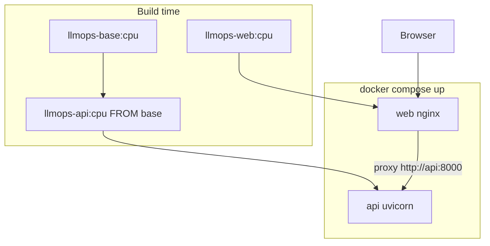
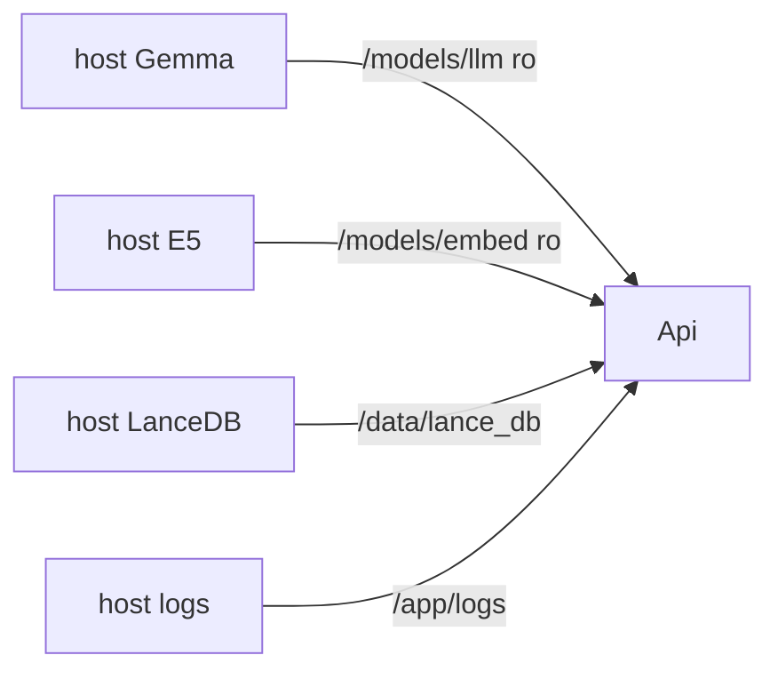

# RAG-system-for-Transformers-Architecture-paper-with-local-SLM
RAG application with Hybrid search, Advance RAG methods and local SLM.

The project is built with a local SLM and embedding model. The retriever uses hybrid search and
multi-query variations.

## Run locally

From `pyfiles/`:

```text
python modelapi_app.py
```

Open http://localhost:8000. FastAPI serves the Retrieval Console and `/query/stream`. `/health` reports load status.

## Docker (split images)

Three images, two running services. Gemma, E5, and LanceDB are **host bind-mounts on `api` only** — never copied into an image.

| Image | Role | Files inside |
| --- | --- | --- |
| `llmops-base:cpu` | Build parent (not started) | `pyfiles/` except `modelapi_app.py` and `static/`; `config.docker.yaml`; `config.yaml`; `pyproject.toml`; CPU torch + pip deps |
| `llmops-api:cpu` | FastAPI (`FROM` base) | `pyfiles/modelapi_app.py` |
| `llmops-web:cpu` | nginx | `pyfiles/static/index.html`, `app.js`, `styles.css`; `docker/nginx.conf` |



At runtime the browser talks only to **web** (host port 80). nginx serves `/` and `/static/`, and reverse-proxies `/health`, `/query/stream`, `/docs`, and other API routes to `api:8000` with buffering off so SSE/`Working...` streams through.



The LanceDB volume must already contain table `transformer_table` (ingest is not part of these images).

Scale the API independently (one nginx, N API replicas — each replica loads its own Gemma/E5 into RAM):

```text
docker compose up -d --scale api=3
```

### Host paths

Copy [`.env.example`](.env.example) to `.env`, or set env vars. Use **forward slashes** on Windows so Compose does not treat `D:` as a volume separator.

| Env var | Default | What to mount |
| --- | --- | --- |
| `LLM_HOST_PATH` | `./models/llm` | Gemma folder (`gemma-4-E2B-it`) |
| `EMBED_HOST_PATH` | `./models/embed` | E5 folder (`intfloat-multilingual-e5-large`) |
| `LANCEDB_HOST_PATH` | `./lance_db/Attention_paper_db` | LanceDB directory with `transformer_table` |
| `LOG_HOST_PATH` | `./logs` | App log files |

Windows example:

```text
LLM_HOST_PATH=D:/Gemma4 2B 4B/gemma-4-E2B-it
EMBED_HOST_PATH=D:/LLMOps/RAG Learn/Models/intfloat-multilingual-e5-large
LANCEDB_HOST_PATH=D:/LLMOps/lance_db/Attention_paper_db
```

Inside the API container, [`config.docker.yaml`](config.docker.yaml) uses `/models/llm`, `/models/embed`, `/data/lance_db`. Override with `GEMMA_MODEL_PATH`, `EMBED_MODEL_PATH`, `LANCEDB_PATH`, `LANCEDB_TABLE`, `LOG_DIR`, or `LLMOPS_CONFIG`.

### Start

```text
docker compose up -d --build
```

This builds `llmops-base` first (Compose `additional_contexts`), then `api` and `web`. The `base` service is a build parent: it runs `true` and exits; it is not a serving process. Open http://localhost (port 80). First generation is slow while CPU loads weights. API healthcheck hits `GET /health` (status `loading` until the pipeline is ready, then `ok`). The API start period is 10 minutes so Gemma load is not treated as a failed container.

Fallback if your Compose build cannot see the base context:

```text
docker build -f docker/Dockerfile.base -t llmops-base:cpu .
docker compose up -d --build
```

```text
docker compose logs -f api web
docker compose down
```

A UI-only change rebuilds `llmops-web` only. Model weights stay on the host and are not part of any image.
